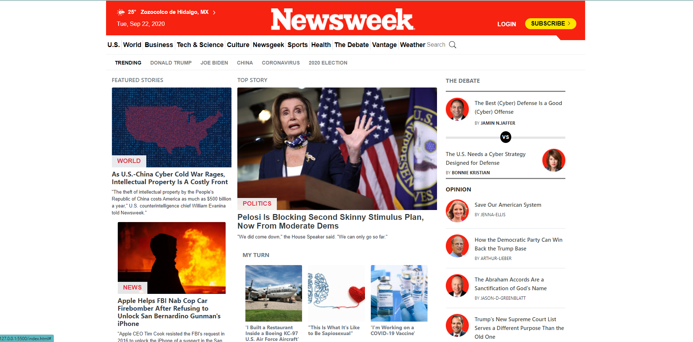

# Using Bootstrap

Building a Clone of the Newsweek using Bootstrap

#HTML, CSS and Bootstrap

We created this project using for the most part Bootstrap
the objective was to clone the website Newsweek.

## Built With

- HTML,
- CSS,
  -Bootstrap

## Live Demo

[Live Demo Link](https://cvilla714.github.io/bootstrap)

👤 **Devkc**

- Github: [@githubhandle](https://github.com/cvilla714)
- Twitter: [@twitterhandle](https://twitter.com/kckeyti)
- Linkedin: [linkedin](https://www.linkedin.com/in/cosmel-villalobos-1900531aa/)

👤 **Huemac Alfredo**

- Github: [@githubhandle](https://github.com/Huemac-Alfredo)
- Twitter: [@twitterhandle](https://twitter.com/AlfredoHuemac)
- Linkedin: [linkedin](https://www.linkedin.com/in/huemac-alfredo-c%C3%B3rdova-torres-b28986136/)
